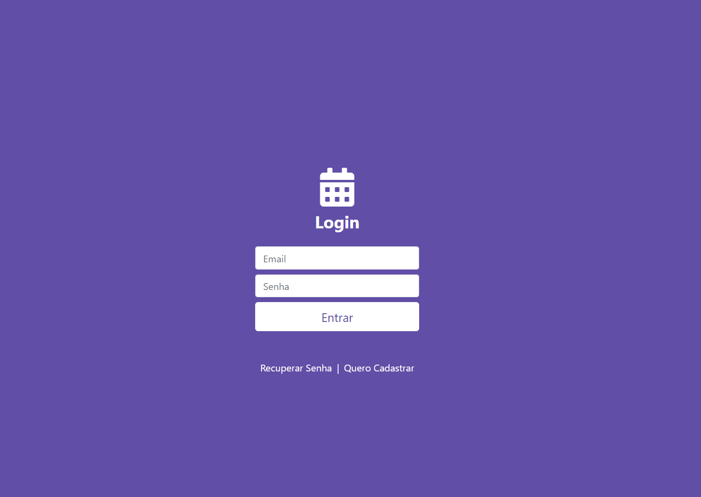
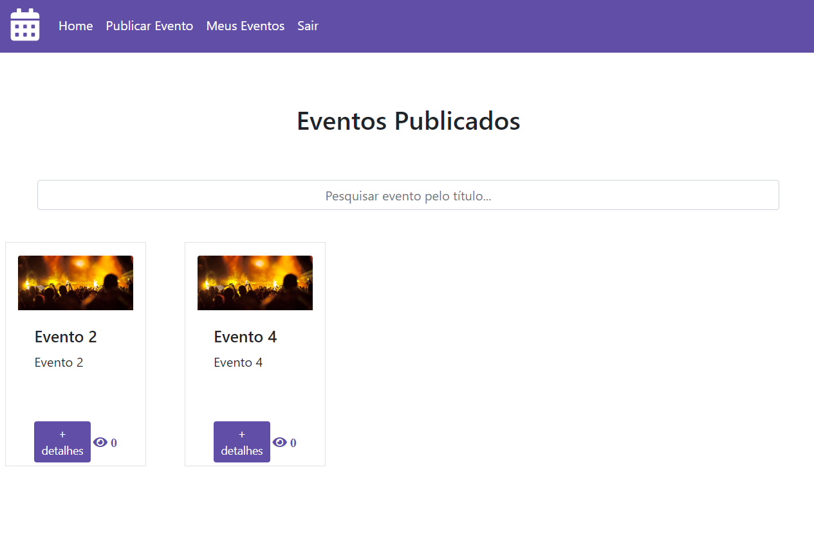

# Eventos

> Este projeto é uma aplicação de publicação de eventos desenvolvida com React JS + Firebase + Bootstrap.

<p align="center">
    
    
</p>

### Iniciar a aplicacão :checkered_flag:

Primeiramente efetue o download das dependências do projeto, executando o comando: <br>

```console
npm install
```

Depois edite o arquivo `.env.example` para `.env` e configure as variáveis do Firebase. <br>

Por fim para rodar a aplicação, execute o comando: <br>

```console
npm start
```

Em seguida, será aberto o endereço [http://localhost:3000](http://localhost:3000) em seu navegador.
